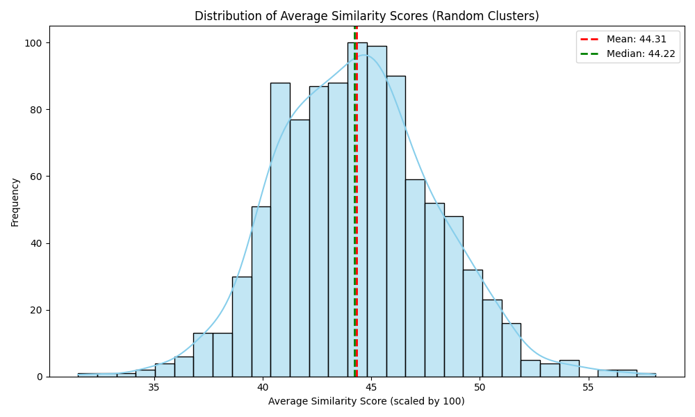

## Method

1. **Code Snippets**: Considered a cluster with 16 code snippets in it.
2. **Semantic Embeddings**: Used the `all-MiniLM-L6-v2` model to convert code snippets into embeddings. This model was actually used for doing the clustering.
3. **Similarity Score**: Calculating pairwise cosine similarities between code snippets
4. **Statistical Validation**: Consider 16 random clusters and computed the average similarity score. Repeated this 1000 times.

### Data Sources
- `cluster.csv`: A curated cluster of 16 semantically related code snippets
- `source.csv`: A larger dataset used for random sampling and baseline comparison with 500+ code snippets.

### Configuration

```python
CLUSTER_SIZE = 16              
NUM_ITERATIONS = 1000           
MODEL_NAME = "all-MiniLM-L6-v2"
SIGNIFICANCE_LEVEL = 0.05       
```

## Results and Analysis


- **Average Similarity Score**: 72.64

### Random Sampling Results
Analysis of 1000 random clusters revealed:

- **Mean Similarity**: 44.31
- **Standard Deviation**: 3.62
- **Median Similarity**: 44.22

### Visualization



The distribution plot shows:
- Clear separation between random and curated clusters
- Normal distribution of random cluster similarities
- Significant difference in mean similarities

### Findings
1. The curated cluster's similarity score is 72.64, but the average similarity score from random sampling is around 44.31.
2. The difference is statistically significant (p < 0.05)

### Conclusion
Therefore, the semantic clustering approach is effective in identifying related code snippets and its not RANDOM.